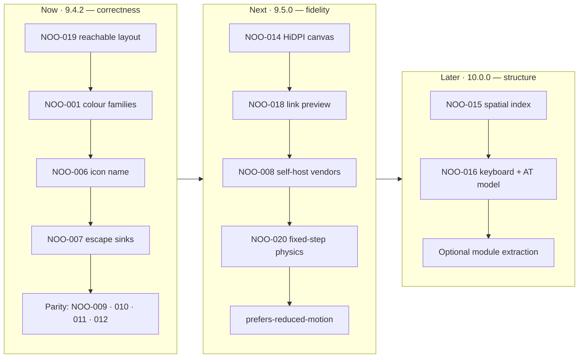

<div align="center">


# NOÖSPHERE // OS

**A single-file browser operating system for polymathic neural cartography, semantic engineering and procedural idea synthesis.**

[](https://github.com/zazieproductions/Prometheus-Noosphere-v9.4/actions/workflows/ci.yml)
[](CHANGELOG.md)
[](LICENSE)
[](#technology-stack)
[](#quick-start)
[](docs/PERFORMANCE.md)
[](CONTRIBUTING.md)
[](CONTRIBUTING.md#commit-convention)

**[Live demo](https://zazieproductions.github.io/Prometheus-Noosphere-v9.4/)** · **[Architecture](docs/ARCHITECTURE.md)** · **[Engine API](docs/API.md)** · **[Design rationale](docs/DESIGN.md)** · **[Roadmap](docs/ROADMAP.md)** · **[Changelog](CHANGELOG.md)**

</div>

---

## Table of contents

- [What this is](#what-this-is)
- [What this is not](#what-this-is-not)
- [Screenshot](#screenshot)
- [Feature map](#feature-map)
- [Quick start](#quick-start)
- [Architecture at a glance](#architecture-at-a-glance)
- [Verified metrics](#verified-metrics)
- [Repository map](#repository-map)
- [Technology stack](#technology-stack)
- [Engineering status](#engineering-status)
- [Documentation index](#documentation-index)
- [Roadmap](#roadmap)
- [Deployment](#deployment)
- [Contributing](#contributing)
- [License](#license)

---

## What this is

NOÖSPHERE // OS is a **browser-resident desktop environment** built inside one HTML document. It renders seven draggable, minimisable, focus-aware windows over a simulated systems desktop, and wires them to ten cooperating client-side engines: a force-directed graph laboratory, a template-composition language engine, a corpus ingestion pipeline, an analytics viewport, an aesthetic synthesiser with Web Audio output, a searchable knowledge base, and a dialectical idea combinator.

It is a **front-end craft project** — the reference implementation for a set of opinions about what a zero-build, zero-dependency, zero-backend interface can look like when the constraints are treated as the design brief rather than as obstacles.

Everything in this repository is **local, self-contained and non-networked**: no API keys, no telemetry, no persistence, no cookies, no build step, no package manager required. The generation engine is deterministic; the graph simulation is procedural rather than seeded (`NOO-021`).

**Design constraints that shaped every decision:**

| Constraint | Consequence |
| --- | --- |
| One document, no build step | All styling, structure and behaviour live in `index.html`; nothing must be compiled to run |
| No runtime dependencies to install | Libraries arrive by CDN and the repository ships zero `node_modules`; pinning them is tracked as `NOO-008` |
| No backend | Every engine executes on the client; the audit toolchain is the only Node.js surface |
| Local and offline | No network, no keys, no server; simulation and generation are procedural functions of local state (seeded determinism is `NOO-021`) |
| Aesthetic as architecture | The CRT/terminal conceit is enforced through a token system, not ad-hoc styling |

---

## What this is not

Honest framing matters more than a pitch. **NOÖSPHERE // OS is fiction — a satirical artefact.** The corpus satirises the vocabulary of growth hacking, semiotic marketing and "memetic warfare" by pushing it to absurd, self-incriminating extremes. It is a piece of critical design, in the tradition of the language it mocks.

- **The "Polymath LLM" is not a language model.** It is a deterministic template-composition engine over a fixed vocabulary table ([`docs/API.md`](docs/API.md#polymathllm--template-composition-engine)). It performs no inference, calls no API, and produces recognisably finite variation. That is the joke *and* the engineering: a "recursive cognition core" that is honestly one vocabulary table and one template literal.
- **Nothing here is marketing advice.** Techniques named in the corpus (infrasound coercion, subliminal indoctrination, paraconsistent PR warfare, "cognitive friction arbitrage") are parodied as sinister, not documented as playbooks. They are not effective, tested, or endorsed.
- **No analytics, no tracking, no uploads.** Dropped files are read with `FileReader` and never leave the tab. There is no `fetch`, `XMLHttpRequest` or `WebSocket` anywhere in the runtime.

---

## Screenshot

> A capture is not committed yet: the default layout is corrected in `9.4.2` (`NOO-019`) and the
> screenshot will be regenerated from a **seeded** run when determinism lands in `9.5.0`
> ([`TESTING.md` § 7](docs/TESTING.md#7-the-road-to-behavioural-tests)). Until then, run it locally in
> five seconds and look at the real thing — it is one file.

```bash
git clone https://github.com/zazieproductions/Prometheus-Noosphere-v9.4.git
cd Prometheus-Noosphere-v9.4 && npm start   # → http://localhost:4173
```

---

## Feature map

Seven windowed subsystems, each owned by exactly one engine.

| Window | Subsystem | Engine | What it demonstrates |
| --- | --- | --- | --- |
| `win-graph` | Neural Vault // Hyper-Graph Atlas | `graphEngine` | Canvas 2D force simulation: semi-implicit Euler integration with pairwise repulsion, Hooke springs, centre gravity, pan/zoom camera, hover inspection HUD, domain filtering |
| `win-terminal` | Synapse-X // Polymath Terminal | `polymathLLM` | A "generative" read-eval-print loop implemented as compositional templating over a vocabulary table; role-typed transcript rendering |
| `win-uploader` | Ingestion Vector // File→Neural | ingestion pipeline | Drag-and-drop and file-picker ingestion, `FileReader` tokenisation, keyword extraction, dynamic graph augmentation |
| `win-analytics` | Memetic Contagion // Telemetry | telemetry simulator | Radar/gauge visualisation of a synthetic corpus, live clock, drift simulation on a 1 Hz interval |
| `win-aesthetic` | Aesthetic Hexonomy & Sound Lab | `paletteGen` / `soundLab` | Curated palette rotation with clipboard export of CSS custom properties; Web Audio oscillator synthesis at 432/528/40 Hz |
| `win-notes` | Grimoire // Aphoristic Fragments | `grimoire` | Client-side substring search across titles, bodies and tags; fragment dispatch into the terminal |
| `win-synthesizer` | Hyper-Idea Combinator | `ideaCombinator` | Dialectical cross-product of two domain vectors into a synthesised axiom, injected as a graph node |

**Global systems:** window manager (drag, z-order, minimise, maximise, grid realignment), CRT/glass chrome, acoustic event vocabulary, 1 Hz system clock, quick-injection modal.

---

## Quick start

### Option 1 — open the file

```bash
open index.html        # macOS
xdg-open index.html    # Linux
start index.html       # Windows
```

No server, no build, no install. The document is the application.

### Option 2 — the bundled zero-dependency dev server

```bash
npm start              # → http://localhost:4173
# or: node scripts/serve.mjs --port 8080 --host 0.0.0.0
```

`scripts/serve.mjs` is ~90 lines of `node:http` with MIME mapping, path-traversal refusal and
dotfile blocking. It exists so that `npm start` works before you install anything.

### Option 3 — any static host

Upload `index.html`. That is the entire deployable artefact. See [`docs/DEPLOYMENT.md`](docs/DEPLOYMENT.md).

### Verify the checkout

```bash
npm test               # static integrity audit; exits non-zero on regression
npm run audit:report   # same, plus reports/audit.json + reports/audit.md
```

Node.js ≥ 18 is required **only** for tooling. The application itself requires nothing.

---

## Architecture at a glance

```
                          index.html  (1 document · 1,477 lines)
┌──────────────────────────────────────────────────────────────────────────────┐
│  <head>            tailwind.config  →  design tokens (colour/type/shadow)     │
│                    <style>          →  CRT, glass, glow, scrollbar, hatching   │
├──────────────────────────────────────────────────────────────────────────────┤
│  chrome            <header>  system status bar   ·  <footer> dock + telemetry │
│  workspace         <main id="workspace">  —  absolutely positioned windows    │
│                    └── .glass-panel ×7   ← every window: one draggable shell  │
├──────────────────────────────────────────────────────────────────────────────┤
│  runtime           single <script>      —  10 engines, ordered by dependency  │
│                                                                              │
│   1 sound        Web Audio oscillator + event vocabulary  ◄── all engines     │
│   2 window mgr   drag · z-order · minimise · maximise · re-align              │
│   3 graph        force simulation · camera · HUD · domain filter              │
│   4 polymathLLM  vocabulary → composition → role-typed transcript             │
│   5 ingestion    FileReader → tokens → node synthesis → graph injection       │
│   6 palette      curated palettes → swatches → clipboard CSS vars             │
│   7 grimoire     fragment corpus → substring index → terminal dispatch        │
│   8 combinator   domain cross-product → axiom → graph injection               │
│   9 modal        manual node authoring                                        │
│  10 telemetry    1 Hz clock + bounded random-walk drift                        │
└──────────────────────────────────────────────────────────────────────────────┘
```

**Boot sequence** — `DOMContentLoaded` → `initGraphEngine()` (90 nodes, ≈270 edges) →
`resizeCanvas()` → `renderGraph()` (self-scheduling `requestAnimationFrame` loop) →
`paletteGen.render()` → `grimoire.render()` → `lucide.createIcons()` → welcome banner.
Every window is wired to `makeDraggable` at parse time, before any engine initialises.

**Data flow** — engines communicate through three shared surfaces only: direct method calls, the
live `graphNodes` / `graphEdges` arrays, and appended DOM in the terminal transcript. There is no
event bus and no global store; the coupling graph is deliberately shallow and acyclic.

Full treatment, including data models, the physics derivation, the camera transform and the
extension seams: **[`docs/ARCHITECTURE.md`](docs/ARCHITECTURE.md)**.

---

## Verified metrics

Measured from `HEAD` by [`scripts/audit.mjs`](scripts/audit.mjs) — reproduce with `npm test`.

| Metric | Value |
| --- | --- |
| Application payload | **88,649 B** (86.6 KiB) · **1,477 lines** · 1 document |
| Contribution of assets | 0 B — no images, fonts or audio are vendored |
| Runtime dependencies installed | **0** |
| Build steps | **0** |
| Windowed subsystems | **7** |
| Engines / modules | **10** |
| Semantic domains | **5** (memetics · semiotics · psychoacoustics · hyperstition · alchemical OS) |
| Boot graph | **90 nodes**, ≈**270** procedural edges, from **15** seed archetypes |
| Physics cost at boot | **4,005** pair evaluations per frame |
| Palette states | **5** × 5 swatches |
| Knowledge fragments | **7** |
| Combinator space | **5 × 5** = 25 dialectical pairings |
| Icon references | **48** across **27** distinct names (26 resolve; `dread` does not — `NOO-006`) |
| Accessibility attributes | **0** (tracked as `NOO-016`) |
| Automated checks | **21** register IDs + 4 always-fatal DOM contract rules |
| Tracked findings | **38**, all within `scripts/audit-baseline.json` |

---

## Repository map

```
Prometheus-Noosphere-v9.4/
├── index.html                     # the entire application
├── package.json                   # tooling entry points only — no dependencies
├── scripts/
│   ├── audit.mjs                  # 18-check static integrity audit (dependency-free)
│   ├── audit-baseline.json        # accepted finding counts — the ratchet
│   └── serve.mjs                  # zero-dependency static server for local dev
├── docs/
│   ├── ARCHITECTURE.md            # runtime topology, data models, physics, seams
│   ├── API.md                     # engine methods, DOM contract, handler map
│   ├── DESIGN.md                  # token system, motion, chrome grammar, rationale
│   ├── DECISIONS.md               # architecture decision records (ADR-001…)
│   ├── ACCESSIBILITY.md           # WCAG 2.2 audit with measured contrast ratios
│   ├── PERFORMANCE.md             # frame budget, complexity analysis, optimisation ladder
│   ├── TESTING.md                 # verification strategy and manual matrix
│   ├── DEPLOYMENT.md              # static hosting, CSP, caching, release checklist
│   ├── MAINTAINABILITY.md         # stewardship, dependency policy, extraction plan
│   ├── ROADMAP.md                 # now / next / later, tied to register IDs
│   └── assets/noosphere-banner.png
├── .github/                       # CI workflow, issue forms, PR template
├── CHANGELOG.md                   # Keep a Changelog
├── CONTRIBUTING.md                # setup, conventions, review rubric
├── SECURITY.md                    # threat model and disclosure policy
└── LICENSE                        # MIT
```

---

## Technology stack

| Layer | Choice | Why |
| --- | --- | --- |
| Markup & behaviour | Hand-authored HTML + vanilla ES2020 | No framework earns its weight for one document; the DOM *is* the component tree |
| Styling | Tailwind Play CDN + a small inline `<style>` layer | Utility velocity for a dense UI; bespoke CRT/glass primitives stay in plain CSS |
| Graph rendering | Canvas 2D + `requestAnimationFrame` | Thousands of primitives per frame with predictable cost; DOM/SVG would buckle under per-node styling |
| Iconography | Lucide (SVG, CDN) | Consistent 24 px stroke geometry; icons are declarative `data-lucide` attributes |
| Type | Cinzel (display) · Syne (UI) · JetBrains Mono (data) | Ritual / editorial / instrument — three registers, three families |
| Audio | Web Audio API oscillators | A few hundred bytes of code instead of vendored samples |
| Tooling | Node.js ≥ 18, stdlib only | The audit and dev server must not introduce a dependency tree the app refuses to have |

**Browser support:** current evergreen Chromium, Firefox and Safari. `backdrop-filter` and the
Web Audio API are required for full fidelity; clipboard export degrades silently via optional
chaining. Internet access is needed at load time for the three CDN dependencies — see
[`docs/MAINTAINABILITY.md`](docs/MAINTAINABILITY.md#dependency-policy) for the rationale and the
planned self-hosting path.

---

## Engineering status

This repository treats **documentation as a first-class deliverable** and **debt as a tracked
register** rather than a surprise. Every known defect has a stable ID, a severity, a baseline
count and a roadmap slot.

`npm test` runs 21 register checks plus four always-fatal DOM contract rules (duplicate IDs,
dangling `getElementById` references, `restoreOrFocus` targets that do not exist, inline handlers
calling undefined globals). It is a **ratchet**: findings may not exceed their baseline, and
improvements are reported so the baseline can be tightened. The current state is green with
38 tracked findings.

| Severity | Register IDs | Findings | Themes |
| --- | --- | --- | --- |
| High | 4 | 14 | undefined colour family (`NOO-001`) · unescaped `innerHTML` sinks (`NOO-007`) · absent accessibility semantics (`NOO-016`) · unreachable default window geometry (`NOO-019`) |
| Medium | 7 | 8 | undefined animation · unresolvable icon · unpinned CDNs · HiDPI canvas · `O(n²)` physics · frame-rate-dependent integration · missing link-preview metadata |
| Low | 9 | 14 | invalid utilities, content/number parity drift, undocked window, static "live" gauges, listener multiplication, unseeded RNG |
| Info | 1 | 2 | dead animation config |

The full register — what each finding means, its user impact and its remediation — lives in
[`docs/ARCHITECTURE.md` § Defect register](docs/ARCHITECTURE.md#defect-register).

---

## Documentation index

| Document | Purpose | Read it when |
| --- | --- | --- |
| [ARCHITECTURE.md](docs/ARCHITECTURE.md) | Runtime topology, engine inventory, data models, physics derivation, extension seams, defect register | You want to understand or modify how it works |
| [API.md](docs/API.md) | Signatures for every engine method, global and handler; the DOM contract; the tooling API | You are writing code against it |
| [DESIGN.md](docs/DESIGN.md) | Token system, typography, motion rules, chrome grammar, aesthetic rationale | You are extending the visual language |
| [DECISIONS.md](docs/DECISIONS.md) | ADRs: single-file, no build, CDN delivery, canvas, procedural data, no persistence | You are questioning a foundational choice |
| [ACCESSIBILITY.md](docs/ACCESSIBILITY.md) | WCAG 2.2 AA audit with measured contrast ratios, remediation plan | You are fixing `NOO-016` or reviewing inclusion |
| [PERFORMANCE.md](docs/PERFORMANCE.md) | Frame budget, complexity model, profiling method, optimisation ladder | You are touching the render loop |
| [TESTING.md](docs/TESTING.md) | Verification strategy, what is covered, manual test matrix, definition of done | You are opening a pull request |
| [DEPLOYMENT.md](docs/DEPLOYMENT.md) | Static hosting recipes, CSP for CDN deps, caching, rollback | You are shipping it |
| [MAINTAINABILITY.md](docs/MAINTAINABILITY.md) | Dependency policy, code-health metrics, extraction plan, stewardship | You are inheriting this repository |
| [ROADMAP.md](docs/ROADMAP.md) | Now / next / later, mapped to register IDs with effort and impact | You want to contribute |
| [CHANGELOG.md](CHANGELOG.md) | Release history in Keep a Changelog form | You are upgrading |
| [CONTRIBUTING.md](CONTRIBUTING.md) | Setup, conventions, commit format, review rubric, recipes | You are contributing |
| [SECURITY.md](SECURITY.md) | Threat model, the `innerHTML` posture, disclosure policy | You are auditing or reporting |

---

## Roadmap

Condensed from [`docs/ROADMAP.md`](docs/ROADMAP.md); every item is traceable to a register ID.



| Horizon | Theme | Headline items |
| --- | --- | --- |
| **Now — 9.4.2** | Correctness | `NOO-019` responsive default layout · `NOO-001` undefined Tailwind family · `NOO-006` invalid icon · `NOO-007` HTML escaping · content/number parity (`NOO-009`…`NOO-012`) |
| **Next — 9.5.0** | Fidelity & trust | `NOO-014` HiDPI canvas · `NOO-018` favicon/OG/description · `NOO-008` self-hosted vendors · `NOO-020` fixed-step integration · `prefers-reduced-motion` |
| **Later — 10.0.0** | Structure & access | `NOO-015` spatial index + worker physics · `NOO-016` keyboard and screen-reader model · ES-module extraction behind an optional bundler |

---

## Deployment

The deployable artefact is `index.html`. GitHub Pages serves it unchanged from the repository root.

```bash
# One-line publish: serve the working tree at http://localhost:4173
npm start
```

Full recipes for GitHub Pages, Netlify, Vercel and Cloudflare Pages — plus the exact CSP header the
CDN dependencies require, immutable caching rules and a release checklist — are in
[`docs/DEPLOYMENT.md`](docs/DEPLOYMENT.md).

---

## Contributing

Contributions are welcome, including to the writing. Before opening a pull request:

```bash
npm test            # must exit 0
npm run audit:json  # inspect findings if it does not
```

1. Read [`CONTRIBUTING.md`](CONTRIBUTING.md) — conventions, commit format, review rubric.
2. Check [`ROADMAP.md`](docs/ROADMAP.md) for the current horizon and pick an unclaimed item.
3. Keep `index.html` the only artefact that must run; tooling stays dependency-free.
4. Commit in [Conventional Commits](https://www.conventionalcommits.org/) form with a scope from the engine inventory (`graph`, `window`, `polymath`, `ingest`, `aesthetic`, `grimoire`, `combinator`, `audit`, `docs`).

Good first issues are labelled [`good first issue`](https://github.com/zazieproductions/Prometheus-Noosphere-v9.4/issues?q=label%3A%22good+first+issue%22); nearly all of
them are small, verifiable corrections to the register above.

---

## License

[MIT](LICENSE) © Zazie Productions.

The corpus text — aphorisms, generated directives, "field reports" — is **satirical fiction**
presented as critical design. It is licensed with the code, and it is not advice.

<div align="center">
<sub>Built as a single file, on purpose. <code>NOÖSPHERE // OS v9.4.1</code></sub>
</div>
