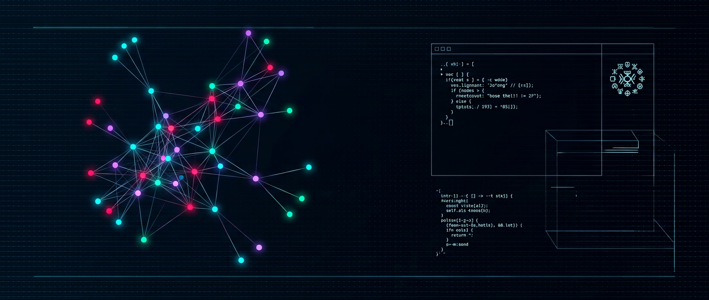

<div align="center">



# NOÖSPHERE // OS

**A zero-build CRT desktop for exploring the Zaziopath corpus, with an optional local host terminal.**

[](https://github.com/zazieproductions/Prometheus-Noosphere-v9.4/actions/workflows/ci.yml)
[](CHANGELOG.md)
[](LICENSE)
[](#launch)
[](CONTRIBUTING.md)

**[Live demo](https://zazieproductions.github.io/Prometheus-Noosphere-v9.4/)** · **[Corpus & provenance](docs/ZAZIOPATH-CORPUS.md)** · **[Architecture](docs/ARCHITECTURE.md)** · **[Runtime API](docs/API.md)** · **[SYNAPSE SHELL](docs/SHELL.md)** · **[Testing](docs/TESTING.md)** · **[Changelog](CHANGELOG.md)**

</div>

---

## What this is

NOÖSPHERE is a zero-build browser desktop with a Canvas force graph, draggable CRT-styled windows, the Polymath Terminal, Ingestion Vector, searchable Grimoire, sound controls, and live archive counts. Its graph and fragments use a stable committed snapshot of [Zaziopath](https://github.com/zazieproductions/Zaziopath), not a generated boot graph or placeholder copy.

The optional SYNAPSE SHELL adds a real local PTY in an eighth window when the application is served from a workstation with its optional shell dependencies installed. It is a separate, explicitly documented trust boundary; it is **not sandboxed** and runs with the user's account permissions. It is loopback-only by default and AI control starts OFF. Read [the shell security and usage guide](docs/SHELL.md) before enabling it.

Zaziopath is presented as a **non-clinical self-analysis archive, creative research instrument, evidence system, recursive notebook, and conceptual laboratory**—not as a personality-diagnosis engine. Source-authored interpretations are represented as what their sources say, not as independent validation.

## Corpus at a glance

The committed dataset is `data/zaziopath-graph.js` (source revision `63d99e311c852b9d57ddc29418455f9bb4ba80b1`):

- **8 strata**, preserving Zaziopath's names, glyphs, and source colors.
- **86 nodes** with artifact identity, summaries, provenance, and excerpt/locator references.
- **117 explicitly sourced relationships**, including the README's indexed cross-stratum wires and documented Shadow → Signal → Stewardship spine.
- **15 searchable, clickable Grimoire fragments** linked to source excerpts and graph nodes.
- Explicit **SOURCE / INFERENCE / SYNTHESIS / OPEN QUESTION** distinctions. Model suggestions and session-created edges are never source facts.

See [Corpus data and provenance](docs/ZAZIOPATH-CORPUS.md) for curation, refresh, privacy, limitations, and fallback behavior.

## What this is not

- **Not a diagnosis tool or validated personality assessment.** The corpus distinguishes self-report, documentary evidence, interpretation, and open questions.
- **Not an upload service.** Dropped files are read with the browser's `FileReader`; graph additions remain in page memory and disappear on reload. They are not written to browser storage or the committed dataset.
- **Not dependent on an LLM for the corpus UI.** The committed graph, simulation, Grimoire, and deterministic lexical retrieval work without Ollama and on static GitHub Pages. Optional inference uses only local `llama3.1:8b` through loopback.
- **Not a cloud inference or vector-database product.** The corpus workflow uses no embeddings, API keys, hosted database, or vector database. The optional host shell has separate pinned workstation-only dependencies described below.
- **Not a sandbox.** SYNAPSE SHELL is a real login shell with the user's ordinary filesystem and process permissions. Do not expose it; its optional remote token is an explicit, high-risk escape hatch.

## Feature map

| Window | What it does |
| --- | --- |
| **Zaziopath Atlas** | Canvas 2D force graph; pan/zoom, deterministic source layout, stratum filters, provenance HUD, relationship highlighting, and marked session nodes |
| **Polymath Terminal** | Bounded source/graph/selection/history context for optional local `llama3.1:8b`; deterministic cited corpus retrieval when unavailable |
| **Ingestion Vector** | Local text/Markdown/CSV/JSON/code reading; up to three high-signal candidates, normalized-name deduplication, source and marked candidate links, session-only retention |
| **Archive Signals** | Live counts for committed source nodes/edges, open questions, epistemic labels, and strata; no behavioral scores |
| **Grimoire** | Searchable source excerpts with provenance; clicking loads context and highlights related graph nodes |
| **Cross-Stratum Synthesis** | Creates a session-local OPEN QUESTION from source records, not a newly asserted connection |
| **Aesthetic / sound controls** | Existing palette, clipboard, and plain Web Audio tone controls |
| **SYNAPSE SHELL** | Optional real PTY, sessions, process/port inspection, and a bounded local-model agent with explicit OFF / ASSIST / AUTONOMOUS control modes |

## Launch

### Static / no Node installation

Open `index.html` directly or deploy the repository root to GitHub Pages. Keep `data/zaziopath-graph.js`, `shell/synapse-shell.js`, and `shell/synapse-shell.css` at their relative paths. The committed graph, simulation, Grimoire, and lexical fallback work without a local API server. SYNAPSE SHELL reports unavailable on static hosts. Full styling, icons, and fonts use existing CDN references and therefore need a network connection.

### Local server

Requires Node.js 18 or newer; no build step is used. The server starts without installing packages and serves the graph UI and local inference fallback. SYNAPSE SHELL stays offline until its optional dependencies are installed.

```bash
npm start
# open http://localhost:4173
```

To enable SYNAPSE SHELL, install its pinned dependencies first. `node-pty` is optional and may require a native toolchain; if it is unavailable, the rest of the desktop still works.

```bash
npm install
npm start
```

Disable PTY startup explicitly with `npm run start:no-shell`. The host shell is unrestricted as the launching user's account; by default its routes require loopback peer, host, origin, and fetch-site checks. Do not expose the server or enable `--shell-remote-token` unless you intentionally accept a remote shell as your user. See [docs/SHELL.md](docs/SHELL.md).

### Optional local Ollama inference

Install Ollama separately and use only `llama3.1:8b`:

```bash
# Terminal 1 — pull only if not already installed
ollama pull llama3.1:8b
ollama serve

# Terminal 2, from this repository
npm start
```

Open `http://localhost:4173`. When the exact model is available, Polymath reports local inference online. If Ollama is absent or a request fails, the UI returns to deterministic corpus retrieval and local extraction. The server accepts only an HTTP loopback Ollama URL; it does not call cloud inference. GitHub Pages and direct-file use remain in fallback mode.

## Validate and test

```bash
npm test                         # graph validation + runtime smoke + static audit + optional shell/UI suites
npm run validate:graph           # committed graph checks only
npm run test:shell               # PTY integration (runs after npm install; skips if deps are absent)
npm run test:ui                  # shell/browser degradation tests (jsdom is dev-only)
npm run audit:json               # static audit details
```

The graph validator checks duplicate IDs/names, dangling endpoints, provenance/excerpts, strata/statuses, and fragment references. Runtime smoke tests cover graph boot, deterministic fallback, bounded Ollama context/failure, loopback-only endpoint validation, Grimoire selection, and ingestion/deduplication. Shell integration tests exercise PTY behavior and the request gate when dependencies are installed. See [Testing](docs/TESTING.md); no browser-level visual test was run for this corpus integration.

## Refresh the committed corpus

Zaziopath is source material, not an npm dependency or runtime fetch. To intentionally refresh the curated snapshot, clone it locally, run the builder, inspect the diff, and validate before committing:

```bash
git clone --depth 1 https://github.com/zazieproductions/Zaziopath.git /tmp/Zaziopath
node scripts/build-zaziopath-graph.mjs --source /tmp/Zaziopath
npm test
git diff -- data/zaziopath-graph.js
```

Curated definitions live in `scripts/build-zaziopath-graph.mjs`; edit that source, not the generated browser file. Every citation anchor is checked during generation.

## Repository map

```text
index.html                         single-document UI and runtime shell
 data/zaziopath-graph.js           committed source-derived corpus snapshot
scripts/build-zaziopath-graph.mjs  curated graph builder and source-anchor checks
scripts/validate-zaziopath-graph.mjs  dependency-free committed-data validator
scripts/test-runtime.mjs           corpus runtime smoke tests
scripts/test-shell.mjs             optional live-PTY integration tests
scripts/test-ui.mjs                optional jsdom shell-degradation tests
scripts/audit.mjs                  static markup/runtime integrity ratchet
scripts/serve.mjs                  static/inference server plus optional PTY bridge
server/                            local shell, request gate, Ollama client, agent, routes
shell/                              SYNAPSE SHELL browser module and styles
docs/ZAZIOPATH-CORPUS.md           provenance, refresh, privacy, fallback
docs/SHELL.md                      host-shell architecture, modes, trust boundary
```

## Technology and dependency boundary

- Hand-authored HTML, vanilla JavaScript, Canvas 2D, Web Audio API; no browser build step.
- Existing Tailwind/Lucide/font CDNs remain presentation dependencies.
- Static corpus exploration and its tests use Node's standard library only.
- Optional SYNAPSE SHELL uses pinned `@xterm/xterm`, `@xterm/addon-fit`, `ws`, optional native `node-pty`, and dev-only `jsdom`; install only when enabling or testing that workstation feature.
- No cloud inference, corpus upload, embeddings, database, or vector database. Private ingestion remains session-local.

## License

[MIT](LICENSE) © Zazie Productions. The Zaziopath corpus remains attributed to its source repository; its claims and interpretations are represented with their recorded provenance and limitations.
