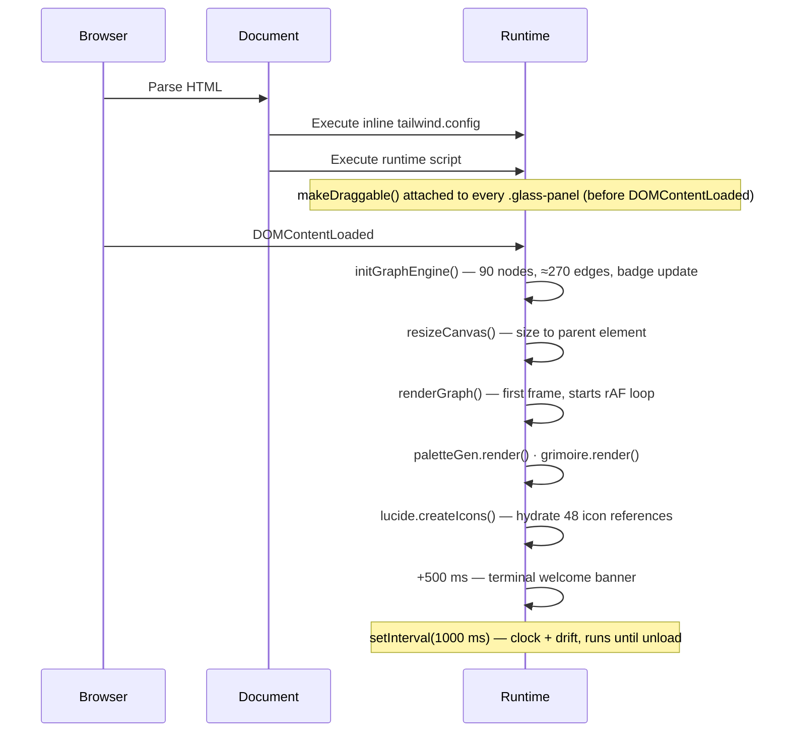

# Architecture

> Runtime topology, data models, algorithms, extension seams and the defect register for
> **NOÖSPHERE // OS v9.4.1**.

**Audience:** engineers reading, reviewing or extending the runtime.
**Prerequisite:** none beyond comfort with the DOM and Canvas. No framework knowledge required.
**Companion documents:** [`API.md`](API.md) for signatures · [`PERFORMANCE.md`](PERFORMANCE.md) for the
frame budget · [`DECISIONS.md`](DECISIONS.md) for why any of this is the way it is.

---

## 1. Purpose and scope

NOÖSPHERE // OS is a **single-document, zero-dependency, zero-build browser operating system**: a
simulated desktop hosting seven windowed subsystems over ten cooperating client-side engines.

This document describes the system as it is implemented in `index.html` at `HEAD`. Every line
reference, count and complexity figure below is reproducible: line anchors were taken from the
current file, and all aggregate numbers are emitted by [`scripts/audit.mjs`](../scripts/audit.mjs)
via `npm test`.

---

## 2. Design constraints

Five constraints were accepted before the first line was written. Every structural decision in this
document is downstream of them.

| # | Constraint | Enforced by | Structural consequence |
| --- | --- | --- | --- |
| C1 | **One document** | `index.html` is the only application artefact | No module system, no bundler, no import graph — engines are ordered by dependency inside one `<script>` |
| C2 | **No build step** | `git clone` → open → runs | Tailwind arrives as the Play CDN (JIT in the browser); no PostCSS, no `tailwind.config.js` output |
| C3 | **No installed dependencies** | Empty `dependencies` in `package.json` | Libraries are referenced by CDN URL; the audit and dev server use the Node standard library only |
| C4 | **No backend** | No `fetch`, `XMLHttpRequest` or `WebSocket` anywhere in the runtime | All state is in-memory and ephemeral; ingestion is local `FileReader` work |
| C5 | **Aesthetic as architecture** | A token layer in `tailwind.config` | Colour, type and elevation are named once and consumed by name — a CRT/glass conceit, not ad-hoc styling |

> C1–C4 are load-bearing for the project's thesis: an interface this dense does not require a
> framework, a compiler or a server. C5 is what keeps that claim from producing an unmaintainable
> document. See [`DECISIONS.md`](DECISIONS.md) for the trade-offs accepted in exchange.

---

## 3. Runtime topology

Three layers, one document. Nothing crosses a layer boundary without an explicit call.

```
┌──────────────────────────────────────────────────────────────────────────────────────┐
│ CHROME                                                                               │
│   <header>  system status bar · acoustics toggle · grid re-align · SYNTHESIZE · clock │
│   <footer>  dock (6 launchers) · neural-load readout · decorative equaliser            │
├──────────────────────────────────────────────────────────────────────────────────────┤
│ WORKSPACE                                     <main id="workspace">                   │
│   absolutely positioned, overlapping, z-ordered window shells — all share one class:  │
│                                                                                      │
│   .glass-panel  (×7)                                                                  │
│     ├── .win-header     drag handle, title glyph, window controls                     │
│     ├── toolbar         per-window controls (filters, directives, search)             │
│     └── .content        engine-owned viewport or canvas                               │
├──────────────────────────────────────────────────────────────────────────────────────┤
│ RUNTIME                                   one <script>, ten engines, in order        │
│                                                                                      │
│   ┌── sound ──────────┐  event vocabulary consumed by every interactive engine         │
│   │   Web Audio       │                                                              │
│   └─────────┬─────────┘                                                              │
│   ┌── window manager ┐  owns z-order, geometry, drag, minimise/maximise/realign        │
│   └─────────┬─────────┘                                                              │
│   ┌── graph ─────────┐  owns 90 nodes · ≈270 edges · camera · HUD                    │
│   │   Canvas 2D      │◄──────────────┐                                               │
│   └─────────┬─────────┘               │ injectNode()                                  │
│             │ analysed in            │                                               │
│   ┌── polymathLLM ───┐  vocabulary →  │  ┌── ingestion ──┐  ┌── combinator ──┐        │
│   │   transcript     │  composition   │  │  FileReader   │  │  cross-product │        │
│   └─────────┬─────────┘               └──┤  tokeniser    │  └───────┬────────┘        │
│             │ ▲                          └───────┬───────┘          │                 │
│   ┌── grimoire ┐ │ dispatch          ┌── modal ────┴──┐               │                 │
│   │  fragments │─┘                   │  manual nodes  │───────────────┘                 │
│   └────────────┘                     └────────────────┘                               │
│   ┌── palette / soundLab ─┐   ┌── telemetry ─┐   (5 palettes · 3 tones · 1 Hz drift)    │
│   └───────────────────────┘   └──────────────┘                                        │
└──────────────────────────────────────────────────────────────────────────────────────┘
```

**Coupling rule.** Engines reach each other through exactly three surfaces:

1. **Direct method calls** across module object literals (`polymathLLM.appendChat`, `graphEngine.injectNode`).
2. **Shared live state** — the `graphNodes` / `graphEdges` arrays and the `camera` record.
3. **DOM as a message log** — the terminal transcript, which is appended to and never read from.

There is deliberately **no event bus and no global store.** With ten engines the indirection would
cost more than it buys, and the resulting coupling graph stays shallow and acyclic — which is what
makes the single-file constraint survivable.

---

## 4. Document anatomy

Verified line anchors from `HEAD` (`index.html`, 1,477 lines):

| Range | Region | Contents |
| --- | --- | --- |
| 1–13 | Document head | Metadata, title, three CDN `<script>`/`<link>` tags |
| 16–61 | `tailwind.config` | Design tokens: colours, font stacks, shadows, animations, keyframes |
| 64–112 | `<style>` | CRT overlay, glass panel, active-window state, glow, hatching, scrollbars |
| 118–163 | `<header>` | Status bar: identity, health, node count, entropy, controls, clock |
| 165 | `#workspace` | Positioning context for all windows (`100vh − 5rem`) |
| 170–222 | `#win-graph` | Neural Vault — toolbar, `<canvas>`, inspector HUD |
| 227–277 | `#win-terminal` | Synapse-X — transcript, directive chips, input line |
| 281–334 | `#win-uploader` | Ingestion Vector — drop zone, artefact feed |
| 339–421 | `#win-analytics` | Memetic Contagion — gauge grid, SVG radar, telemetry log |
| 427–506 | `#win-aesthetic` | Hexonomy & Sound Lab — swatches, tone buttons, copy/colour cards |
| 510–536 | `#win-notes` | Grimoire — search field, fragment list |
| 541–586 | `#win-synthesizer` | Hyper-Idea Combinator — domain selectors, mutation output |
| 591–636 | `<footer>` | Dock (6 launchers), neural load, decorative equaliser |
| 638–669 | Modal | Quick idea injection — title, cluster, analysis, commit |
| 675–1475 | Runtime `<script>` | Ten engines plus initialisation (see §6) |

---

## 5. Boot sequence

Deterministic, single-pass, no `async` coordination. Total work is bounded and measurable.



Two ordering facts matter:

- **`makeDraggable` is bound at parse time**, before any engine initialises. Every window is
  draggable from first paint, independently of engine readiness.
- **`renderGraph` self-schedules.** The loop is started once and never stopped; visibility is not
  currently considered (see `NOO-015` and the optimisation ladder in `PERFORMANCE.md`).

---

## 6. Engine inventory

| # | Engine | Line | Owns | Consumes | Emits |
| --- | --- | --- | --- | --- | --- |
| 1 | `sound` / `soundLab` | 677 | `audioCtx`, `audioEnabled` | user gestures | oscillator tones; `playBeep()` is the global event sound |
| 2 | window manager | 729 | `highestZ`, drag state, geometry | pointer events | focus/z-order mutation, beeps |
| 3 | graph engine | 840 | `graphNodes`, `graphEdges`, `camera`, `showLabels`, `activeDomainFilter`, `hoveredNode` | pointer + wheel, filters, injections | frame rendering, inspector HUD |
| 4 | `polymathLLM` | 1144 | transcript DOM, `VOCAB` | prompts, directives, grimoire fragments, ingestion events | role-typed transcript entries |
| 5 | ingestion | 1247 | `FileReader` lifecycle | drop/picker events | graph nodes, artefact feed rows, transcript notices |
| 6 | `paletteGen` | 1307 | `currentPaletteIdx`, `PALETTES` | user clicks | swatch DOM, clipboard writes |
| 7 | `grimoire` | 1352 | `GRIMOIRE_DATA` | search input | fragment cards, terminal dispatch |
| 8 | `ideaCombinator` | 1393 | selection values | two domain vectors | synthesised axiom, graph node |
| 9 | modal | 1420 | modal visibility | user authoring | graph node |
| 10 | telemetry | 1444 | clock text, drift values | 1 Hz interval | clock, two gauge strings |

Every engine is a **plain object literal or a small set of functions** with an explicit public
surface, documented in [`API.md`](API.md). No prototypes, no classes, no inheritance — the surface
area of the system is small enough that composition by convention is sufficient and cheaper to read.

---

## 7. Data models

### 7.1 Graph node

```js
{
  id: 0,                       // Number — index into graphNodes; also the edge endpoint key
  title: 'Baudrillardian Simulacra',
  domain: 'semiotics',         // key into DOMAINS
  desc: 'Phase 4 sign-order simulation. The product precedes reality.',
  valence: '99.4%',            // decorative resonance metric (string, pre-formatted)
  x: 0, y: 0,                  // Number — world coordinates, centred on the origin
  vx: 0, vy: 0,                // Number — velocity, damped each frame
  radius: 5.5,                 // 5.5 for seed archetypes, 3.2 for procedural variants
  color: '#a855f7'             // denormalised copy of DOMAINS[domain].color (see NOO-021 note)
}
```

*Invariant:* `0 ≤ id < graphNodes.length`, and `graphEdges[i].source` / `.target` are always valid
indices. `injectNode` maintains this by construction.

### 7.2 Graph edge

```js
{ source: 12, target: 15 }     // directed record, rendered and integrated as undirected
```

Edges are **not deduplicated** and are permitted to be reciprocal: the generator samples
`target = (i + 1 + rand(0..11)) % n`, which guarantees `target ≠ i` but not uniqueness. Duplicate
edges simply double a spring's contribution — harmless for a decorative simulation, and cheaper than
maintaining an adjacency set at this scale.

### 7.3 Camera

```js
{ x: 0, y: 0, zoom: 1 }        // pan in screen px; zoom clamped to [0.3, 3.0]
```

### 7.4 Domain

```js
DOMAINS = {
  memetics:        { name: 'Memetics',        color: '#ff0055' },
  semiotics:       { name: 'Semiotics',       color: '#a855f7' },
  psychoacoustics: { name: 'Psychoacoustics', color: '#ffaa00' },
  hyperstition:    { name: 'Hyperstition',    color: '#00ff9d' },
  alchemy:         { name: 'Alchemical OS',   color: '#00f7ff' }
}
```

Domain keys are the join key between `graphNodes`, the filter toolbar (four of five appear there —
`alchemy` does not, tracked as `NOO-011`) and the modal's cluster selector (four of five — `alchemy`
again absent).

### 7.5 Transcript entry

Not a data structure — a DOM node appended to `#terminal-output` and scrolled into view. Three
roles, three visual treatments, defined in `polymathLLM.appendChat`: `user`, `system`, `assistant`.

### 7.6 Grimoire fragment

```js
{ title: 'Hyperstitional Arbitrage', tags: '#finance #memetics', text: '…' }
```

Search is a case-insensitive substring match across all three fields — linear, 7 records, no index.

### 7.7 Palette

```js
PALETTES[5][5] = ['#030509', '#0e1424', '#00f7ff', '#ff0055', '#a855f7']
```

Five curated five-colour states, rotated by `paletteGen.mutate()`, exportable as CSS custom
properties (`--accent-1` … `--accent-5`).

---

## 8. The force simulation

`updatePhysics()` runs once per frame over the whole graph. Three forces, integrated semi-implicitly
(Euler with velocity damping).

### 8.1 Force terms

| Term | Formula | Constant | Radius |
| --- | --- | --- | --- |
| Pairwise repulsion | `F = k_repel / d²`, applied along `±(dx, dy)/d` | `k_repel = 220` | only when `d < 260` |
| Structural springs | `F = (d − 75) · k_spring`, rest length **75 px** | `k_spring = 0.003` | every edge |
| Centre gravity | `F = −p · k_gravity` (pull toward the origin) | `k_gravity = 0.0008` | all nodes |
| Damping | `v ← v · 0.88` | per frame | all nodes |

```js
// paraphrase of updatePhysics(), index.html:929–978
for each pair (i < j) within 260px:  v ← v ± (dx/d) · (k_repel / d²)
for each node:                        v ← v − p · k_gravity
for each edge:                        v ← v ± (dx/d) · ((d − 75) · k_spring)
for each node:                        v ← v · 0.88 ; p ← p + v
```

### 8.2 Reading the constants

- **Rest length 75 px with a 260 px repulsion radius** produces the observed texture: dense local
  organic clusters that still separate globally, because the repulsion cutoff is ≈3.5× the spring
  rest length.
- **Damping 0.88 per frame** gives a snappy visual settle (≈90 % of residual velocity removed every
  20 frames) at the cost of never being strictly at rest.
- **Gravity is an order of magnitude weaker than the springs** — it prevents drift off-canvas
  without collapsing clusters into a disc.

### 8.3 Complexity and stability

| Property | Value at boot | Notes |
| --- | --- | --- |
| Nodes | 90 | 15 seed archetypes × 6 procedural generations |
| Edges | ≈270 expected (2–4 per node, uniform) | stochastic, reported empirically |
| Broad-phase pairs | **4,005 per frame** | `n(n−1)/2`, no spatial index — tracked as `NOO-015` |
| Per-frame integration | `O(n²) + O(E)` | repulsion dominates |
| Published frame rate | "Canvas 60fps" (window badge) | aspirational; see `PERFORMANCE.md` |

**Stability.** The scheme is explicit Euler with strong damping; `k_repel/d²` diverges as `d → 0`,
so the squared-distance term is floored with `+ 0.01`. At 90 nodes the simulation is stable in
practice at every zoom level because zoom is a *view* transform and never feeds back into physics.

**Frame-rate coupling.** The integrator advances by a constant increment per frame with no
`deltaTime` term, so a 144 Hz display runs the simulation ≈2.4× faster than a 60 Hz display. The
loop is *stable* at both rates, but the dynamics are not time-invariant. Tracked as `NOO-020`; the
remediation (fixed 60 Hz accumulator with an interpolation step) is scoped to `9.5.0`.

---

## 9. Camera and coordinate transform

The world origin is the canvas centre; the camera is a pure view transform applied with
`ctx.translate` → `ctx.scale`.

```
screen = world · zoom + (canvas/2 + camera)
world  = (screen − canvas/2 − camera) / zoom
```

| Operation | Handler | Rule |
| --- | --- | --- |
| Pan | `mousedown` on canvas → `mousemove` | `camera.x += dx ; camera.y += dy` (screen-space delta, unscaled) |
| Zoom | `wheel` (default prevented) | `×1.1` per notch in, `×0.9` out; clamped to `[0.3, 3.0]` |
| Hit test | `mousemove` | nearest node within `radius·2 + 5` world units, first match wins |
| Label level-of-detail | `renderGraph` | labels drawn when `zoom > 0.8 **or** node is hovered **or** `radius > 5.5` |

The LOD rule is why seed archetypes stay legible when zoomed out while procedural variants stay
clean — a one-line hierarchy expressed as a boolean, not a rendering tier system.

---

## 10. Window manager

Seven `.glass-panel` elements share one behaviour set, attached at parse time.

| Concern | Mechanism | Notes |
| --- | --- | --- |
| Focus | `bringToFront(win)` | `highestZ += 2`, then reassign; every other panel loses `.window-active` |
| Z baseline | `highestZ = 50`, initial `z-index: 30/25/22/21/20/19/18` | Windows are interleaved below the chrome (`z-50`) |
| Drag | `mousedown` on `.win-header` | Position clamped to `≥ 0` on both axes; button hits are excluded via `closest('button')` |
| Drag hygiene | `body.no-select` during drag | Prevents text selection while moving |
| Minimise | `display: none` | State lives entirely in the `display` property |
| Restore | `restoreOrFocus(id)` | Clear `display`, then focus — dock buttons call this exclusively |
| Maximise | `dataset.maximized` snapshot | Stores `origW/H/T/L` in `dataset`, restores verbatim; *not* viewport-aware on resize |
| Re-align | `resetWindowPositions()` | Reapplies the authored 7-window grid |

**Geometry reality.** The authored grid spans **1760 × 880 px**. Windows are positioned absolutely
with fixed pixel widths, so:

- on a **1440 px** viewport the right-hand column is clipped — recoverable, because the window is docked;
- on a **1280 px** viewport `win-synthesizer` (x = 1380) is entirely off-canvas and **has no dock
  entry**, so it is unreachable without a reload;
- on narrow/mobile viewports this is a hard limitation, not a degradation.

This is `NOO-019`, rated high, and it is the first item in the `9.4.2` horizon. The fix is a
view-preserving, viewport-aware layout algorithm (clamp-and-flow on boot and on resize) rather than
a responsive rewrite — the desktop metaphor is intentional, but unreachable windows are a defect.

**Listener note.** `makeDraggable` binds its `mousemove` and `mouseup` handlers to `document` once
per window (7 × 2 = 14 permanent listeners) rather than to a single delegated set. Correct, but
quadratic in window count; tracked as `NOO-017`.

---

## 11. Ingestion pipeline

```
drop | pick  →  FileReader.readAsText  →  tokenise (\s+)  →  filter (len > 5)
      →  title construction  →  domain sampling  →  graphEngine.injectNode()
      →  artefact feed row  →  transcript notice  →  status settle (600 ms)
```

| Stage | Implementation | Note |
| --- | --- | --- |
| Accept | `drop`/`dragover` with `preventDefault`, plus a hidden `<input multiple>` | Both paths converge on `processFiles()` |
| Read | `FileReader.readAsText` per file, independent callbacks | No ordering guarantee — genuinely concurrent |
| Tokenise | `content.split(/\s+/)`, keep tokens longer than 5 characters | Deliberately naive; documented as a keyword sketch, not NLP |
| Title | First two long tokens joined by `_`, else the filename uppercased | `BAUDRILLARD_SIMULACRA` |
| Domain | Uniform sample from four domains (excludes `alchemy`) | Inconsistent with the modal selector's four (excludes `alchemy`) and the filter's four (excludes `alchemy`) — see `NOO-011` |
| Materialise | `injectNode()` → node array, 3 random edges, badge count, tone | Node enters the live simulation immediately |
| Report | Feed row with a synthetic synapse delta; transcript system message | The delta is generated, never measured |

**Verdict on the drop-zone copy.** The UI advertises `.PDF`. `readAsText` on a binary PDF yields
mojibake, so the practical input is plain text and Markdown. This is a copy-accuracy defect rather
than a code defect; it is tracked in the accuracy register as `NOO-009` and corrected in `9.4.2`.

---

## 12. The composition engine (Polymath LLM)

The interface calls this a "recursive polymath LLM". It is a **deterministic template-composition
engine over a fixed vocabulary table**, and it is documented here as such because the honest
version is more interesting than the pretence.

```js
VOCAB = {
  openings: [5 strings],   // framing clauses
  tenets:   [5 strings],   // axiomatic assertions
  actions:  [4 strings]    // execution-matrix steps
}
```

Composition rule (`polymathLLM.generatePolymathResponse`, `index.html:1209–1232`):

```
response = opening[i]                    // uniform, 5 options
         ∪ tenet[j]                      // uniform, 5 options
         ∪ tenet[(k + 1) mod 5]          // uniform over the 4 values ≠ tenet[j]
         ∪ actions[0..3]                 // fixed, joined
         ∪ confidence(97.00–99.90 %)     // uniform, 291 discrete values
```

| Property | Value |
| --- | --- |
| Distinct argument structures | **5 × 5 × 4 = 100** |
| Surface variations incl. confidence | **≈ 29,100** |
| Inputs consumed | **none** |
| Inference performed | **none** |
| Latency | fixed `setTimeout(…, 400)` — a deliberate, honest simulation of "thinking" |
| Network calls | **0** |
| Storage | none — the transcript is a DOM log, discarded on reload |

**The prompt parameter is never read.** `generatePolymathResponse(prompt)` accepts the user's input
and ignores it entirely; the response depends only on the RNG. This is disclosed here, in
[`API.md`](API.md) and on the README rather than hidden, because the whole artefact is a piece of
critical design about generative-sounding systems that generate nothing. Determinism is the point —
and it is what makes the module testable without a network stub.

**Extensibility.** Because composition is a pure function over `VOCAB`, the "model" can be
re-tuned by editing one object literal: no prompt engineering, no tokens, no cost.

---

## 13. Audio subsystem

Web Audio, oscillators only — no vendored samples.

| Concern | Implementation |
| --- | --- |
| Context | Lazily created on first gesture (`initAudio`), so autoplay policy is never violated |
| Voice | `OscillatorNode` → `GainNode` → destination, one voice per event |
| Envelope | Instant attack, exponential decay to `0.0001` over `duration` |
| Failure mode | Entire body wrapped in `try/catch` — audio failure never breaks an interaction |
| Mute | `audioEnabled` short-circuits every call; the toggle re-renders its own icon and label |
| Tone vocabulary | 432 Hz "solfeggio", 528 Hz "bio-resonance", 40 Hz "gamma" — presented as psychoacoustic presets, implemented as three oscillator frequencies |

Every engine emits sound through the same `playBeep(freq, type, duration, vol)` call, which is why
the interface *feels* coherent: one acoustic grammar, ten consumers.

---

## 14. Styling architecture

Two layers, one token source.

**Layer 1 — tokens in `tailwind.config` (lines 16–61).** Consumed by utility class name only.

| Token group | Members | Purpose |
| --- | --- | --- |
| Surfaces | `void`, `obsidian`, `surface`, `surface-bright` | Four-step elevation ramp, `#030509` → `#172138` |
| Accents | `neon.cyan`, `neon.amber`, `neon.violet`, `neon.crimson`, `neon.emerald`, `neon.hyper` | Semantic roles: focus/confirm/warning/danger/positive/emphasis |
| Type | `mono` → JetBrains Mono, `sans` → Syne, `esoteric` → Cinzel | Instrument / editorial / ritual registers |
| Elevation | `shadow.neon-*`, `shadow.glass` | Two glow intensities plus the deep panel shadow |
| Motion | `animation.pulse-glow`, `animation.scanline` | Declared; currently unapplied (`NOO-005`) |

**Layer 2 — hand-written primitives in `<style>` (lines 64–112).** Only what utilities cannot
express: the CRT overlay pseudo-element, `backdrop-filter` glass, the active-window glow state,
two-layer dot hatching, crosshair cursor and the scrollbar skin.

The split is intentional: **utilities own layout and colour; CSS owns texture.** A utility-only
approach cannot express a `::before` scanline overlay or a composited backdrop blur, and a
CSS-heavy approach would bury the layout in prose.

**Known defect in this layer.** Six utilities reference `crimson-*` (`border-crimson-900/60`,
`bg-crimson-950/60`, `border-crimson-900/40`, `border-crimson-700/50`) but the token is registered
as `neon.crimson`, so the generated class names are `neon-crimson-*`. Those six utilities silently
produce nothing, and the affected borders fall back to `currentColor`. Tracked as `NOO-001` — the
single most-reported cosmetic defect in the register. Full data in
[`DESIGN.md` § Token system](DESIGN.md#2-token-system).

---

## 15. Extension seams

Each extension point is a single, well-bounded edit. None requires touching more than two locations.

| Goal | Edit | Locations | Effort |
| --- | --- | --- | --- |
| Add a window | New `.glass-panel` marked with `id="win-…"` + `makeDraggable` (automatic) + dock button calling `restoreOrFocus('win-…')` | Markup; optional engine | S |
| Add a domain | Add to `DOMAINS`, add a filter button with `graphEngine.filterDomain('…')`, add to the modal selector | 3 tables | S |
| Add seed knowledge | Append to `rawSeedThemes` | 1 array | XS |
| Add an engine | Define an object literal inside the runtime script, call it from `DOMContentLoaded` | 1 region | M |
| Add a directive | Add a `VOCAB` slice + a `runDirective` branch + a chip in the toolbar | 3 places | S |
| Add a palette | Append to `PALETTES` | 1 array | XS |
| Add a fragment | Append to `GRIMOIRE_DATA` | 1 array | XS |
| Change the acoustic grammar | `playBeep` call sites or `soundLab` presets | 1 module | S |

**Extraction seam (future).** The ten engines are already isolated by comment banner and by
identifier; they correspond 1:1 with the proposed ES modules in
[`MAINTAINABILITY.md` § Extraction plan](MAINTAINABILITY.md#5-extraction-plan). The single-file
constraint is a delivery decision, not a structural one — the code is extraction-ready, which is
precisely why it does not need to be extracted yet.

---

## 16. Verified invariants

These hold at `HEAD` and are enforced by the four always-fatal rules in `scripts/audit.mjs`. A
violation fails CI regardless of baseline.

| Invariant | Rule |
| --- | --- |
| Every `id` is unique | Duplicate ID detection |
| Every `getElementById('x')` resolves | Dangling-reference detection (42 IDs, 0 dangling) |
| Every `restoreOrFocus('win-x')` target exists | Dock integrity check |
| Every inline handler calls a defined global | Handler resolution (properties excluded) |

The remaining 21 register checks are **ratcheted** rather than gated: findings may not exceed their
baseline, and improvements are surfaced for the baseline to be tightened. See
[`TESTING.md`](TESTING.md) for the rationale behind a ratchet instead of a hard gate.

---

## 17. Defect register

Every known defect, with evidence and remediation. This table is the canonical source for the
roadmap, the changelog and `scripts/audit.mjs` titles.

| ID | Sev. | Finding | Evidence at `HEAD` | Remediation |
| --- | --- | --- | --- | --- |
| `NOO-001` | High | Undefined colour family | 6 utilities reference `crimson-*`; the token is `neon.crimson` | Rename to `neon-crimson-*` (or register a top-level `crimson` family) |
| `NOO-002` | Low | Invalid spacing step | `py-0.2` ×2 — Tailwind ships `.5` fractions only | Use `py-0.5` or an arbitrary value |
| `NOO-003` | Med | Animation used, never defined | `animate-fadeIn` on ingested artefact rows | Declare `fadeIn` keyframes/animation in the config |
| `NOO-004` | Low | Project class never defined | `.no-scrollbar` used on the directive strip | Add the utility rule |
| `NOO-005` | Info | Dead animation config | `pulse-glow`, `scanline` declared, zero call sites | Apply or delete |
| `NOO-006` | Med | Unresolvable icon | `data-lucide="dread"` is not a Lucide icon | Choose a real name (e.g. `brain-circuit`) |
| `NOO-007` | High | Unescaped `innerHTML` sinks | 4 sites interpolate prompt text and dropped filenames | Route through `textContent` / `escapeHtml()` |
| `NOO-008` | Med | Unpinned runtime dependency | `cdn.tailwindcss.com`, `unpkg.com/lucide@latest` | Pin versions; self-host for offline parity |
| `NOO-009` | Low | Advertised volume ≠ shipped | "240+ fragments", 7 shipped | Correct the copy, or ship the corpus |
| `NOO-010` | Low | Counter parity drift | Badge 142 / banner "120+" / engine spawns 90 | Derive all three from `graphNodes.length` |
| `NOO-011` | Low | Domain has no filter | `alchemy` is in `DOMAINS` but absent from the toolbar | Add the filter button |
| `NOO-012` | Low | Window absent from dock | `win-synthesizer` has no `restoreOrFocus` entry | Add a dock button |
| `NOO-013` | Low | "Live" readouts are static | `entropy-val`, `stat-sub`, `radar-poly`, `telemetry-log` — 0 runtime writes | Drive from state, or relabel as static |
| `NOO-014` | Med | Canvas not HiDPI-scaled | No `devicePixelRatio` handling | Scale backing store; store DPR in the resize path |
| `NOO-015` | Med | `O(n²)` broad phase | 4,005 pairs/frame, no spatial index | Uniform grid / Barnes–Hut; optionally a worker |
| `NOO-016` | High | No accessibility semantics | 0 `aria-*`, 0 `role`, 0 `tabindex`; 7 `outline-none` | Keyboard model + roles + live regions |
| `NOO-017` | Low | Listener multiplication | 2 `document` listeners × 7 windows = 14 permanent | Delegate once, or bind during drag only |
| `NOO-018` | Med | No link-preview metadata | No description, favicon or OG tags | Add meta set + favicon |
| `NOO-019` | High | Unreachable default geometry | Layout spans 1760 × 880; `win-synthesizer` needs ≥1500 px and is undocked | Viewport-aware layout on boot and resize |
| `NOO-020` | Med | Frame-rate-dependent physics | No `deltaTime` in `updatePhysics` | Fixed-timestep accumulator at 60 Hz |
| `NOO-021` | Low | Initial state is not reproducible | 19 unseeded `Math.random()` call sites, no seeded PRNG | Seed a local PRNG (e.g. `mulberry32`) for spawn, injection and drift |

> **Implementation note — denormalised colour cache.** Not a defect, recorded here so it is not
> "fixed" by mistake: `node.color` copies `DOMAINS[domain].color` at creation. The render loop reads
> `n.color` for every node every frame, and a property read is cheaper than a two-level lookup inside
> the hottest loop in the system. If the domain palette ever becomes themeable, this becomes a
> cache-invalidation concern rather than a micro-optimisation.

---

## 18. Vocabulary: project language → engineering meaning

The interface speaks in occult-systems language. This table is the honest translation layer, and it
exists so that no reader has to guess whether a term describes a mechanism or a mood.

| Interface term | Engineering reality |
| --- | --- |
| Neural Vault / hyper-graph atlas | Force-directed graph rendered on Canvas 2D |
| Synapse count | `graphNodes.length` |
| Memetic valence / resonance index | Decorative pre-formatted string; not measured |
| Entropy quotient | Static string; no computation behind it |
| Polymath LLM / cognition core | Deterministic template composition over a fixed vocabulary (§12) |
| Hyperstition blueprint | A preset directive string routed to the composer |
| Ingestion vector | `FileReader.readAsText` + whitespace tokenisation |
| Alchemical OS cluster | A colour-coded domain; currently unfilterable (`NOO-011`) |
| Telemetry / warfare log | Authored placeholder rows; one gauge pair drifts randomly |
| Grimoire | A seven-record array with substring search |

Publishing this table is a deliberate choice. A portfolio artefact that invites technical scrutiny
should survive it, and the fastest way to demonstrate engineering judgement is to be the first
person to state the limits of the thing you built.

---

<div align="center">
<sub>Next: <a href="API.md">Engine API reference →</a></sub>
</div>

## Optional local inference path (current runtime)

Historical sections above describe the original deterministic engine and static-only
architecture. With `npm start`, the browser now probes same-origin `/api/noosphere/status`
and submits prompts plus bounded in-memory graph/grimoire/terminal/ingestion context to
`/api/noosphere`. The Node development server alone contacts loopback Ollama (`llama3.1:8b`)
using native `fetch`; the browser never contacts Ollama directly. On failure the existing
composer remains operational. File-open and GitHub Pages deployments still use simulation;
no backend or model runs on a static host. The local API refuses non-loopback callers.
