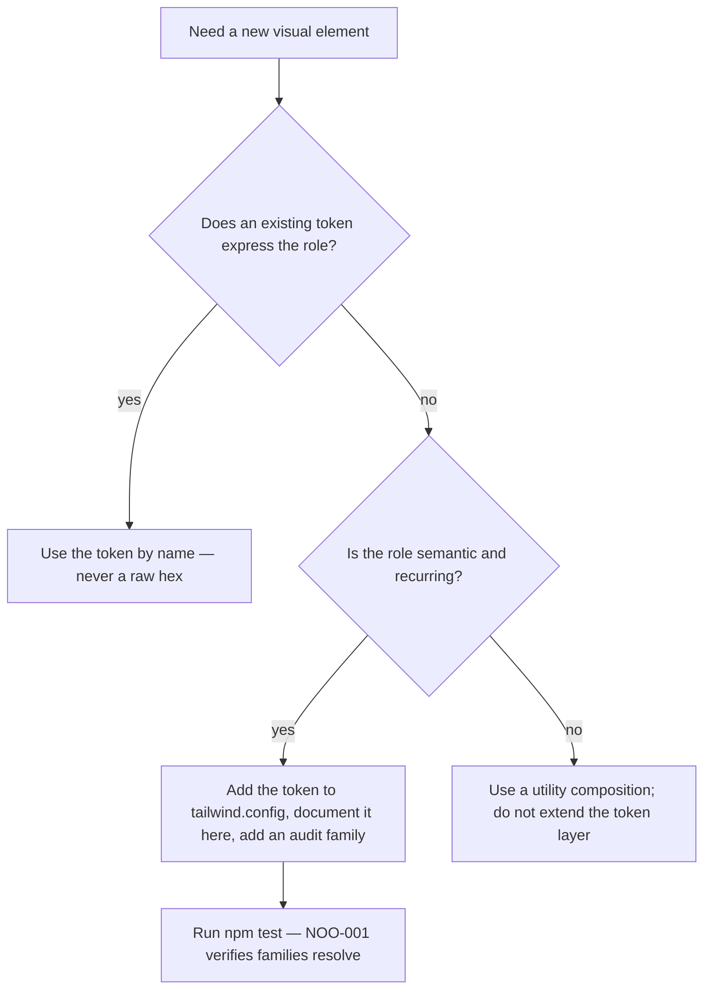

# Design System

> The visual language of NOÖSPHERE // OS: tokens, type, motion, chrome grammar and the reasoning
> behind them — written as a system, not as a mood board.

**Scope:** the design of the interface. For the honesty policy governing the corpus language it
presents, see [§ 9 Satire and disclosure](#9-satire-and-disclosure).

---

## 1. Thesis

The interface is a **CRT terminal that grew a window manager.** Three convictions follow from that,
and every rule below is downstream of them.

1. **Instrument, not dashboard.** Data is set in monospace at small sizes with tight tracking, the
   way measurement equipment prints. Prose is not; editorial text uses a different family entirely.
2. **Darkness is the substrate, light is the signal.** Surfaces are four near-black steps; colour is
   reserved for meaning. A saturated hue on screen means the system is telling you something.
3. **Texture is earned.** Scanlines, glass, glow and hatching are used where they explain something
   about the metaphor (a screen, a raised panel, a focus state, a coordinate space) and nowhere else.

The design problem this solves is specific: **a dense technical toy must still read as considered.**
That is why there is a token layer, a documented contrast budget and a written motion policy rather
than a pile of inline styles.

---

## 2. Token system

Tokens are declared once in the inline `tailwind.config` block (`index.html:16–61`) and consumed by
name. There are no hard-coded hex values in the workspace markup — colour always arrives as a token.

### 2.1 Surfaces — the four-step elevation ramp

| Token | Hex | Role |
| --- | --- | --- |
| `void` | `#030509` | Page substrate, canvas interior, terminal well |
| `obsidian` | `#080c14` | Chrome bars, window headers, insets |
| `surface` | `#0e1424` | Panel bodies, inputs, cards |
| `surface-bright` | `#172138` | Hover/active state of `surface` — the only *interactive* surface step |

The ramp is intentionally shallow (steps of roughly 4–5 % luminance). Depth is communicated by
**borders and elevation shadows**, not by brightness — which is what keeps a dense dark UI from
turning into grey mush.

### 2.2 Accents — semantic, not decorative

| Token | Hex | Semantic role | Where it appears |
| --- | --- | --- | --- |
| `neon.cyan` | `#00f7ff` | **System / focus / primary action** | Identity, graph, active window, primary CTA |
| `neon.emerald` | `#00ff9d` | **Healthy / confirm / live** | Status pulse, terminal core, synthesis confirm |
| `neon.amber` | `#ffaa00` | **Warning / ingestion / pending** | Upload states, node counts, latency |
| `neon.crimson` | `#ff0055` | **Danger / analytical / alert** | Analytics viewport, negative controls, threat metrics |
| `neon.violet` | `#a855f7` | **Aesthetic / secondary concept** | Palette engine, hexonomy, semiotic accents |
| `neon.hyper` | `#f43f5e` | **Emphasis (reserved)** | Registered but currently unapplied |

Rule: **an accent hue owns a subsystem.** Cyan is the system's voice, emerald its health, amber its
process, crimson its analysis, violet its aesthetic. A component that borrows a hue outside its lane
is a bug, not a stylistic choice.

### 2.3 Contrast budget (measured)

Ratios computed with the WCAG 2.x relative-luminance formula against the four surface steps. Small
UI text (9–11 px dominates this interface) is held to the **AA small-text threshold of 4.5:1**.

| Foreground | on `void` | on `obsidian` | on `surface` | on `surface-bright` | Verdict |
| --- | --- | --- | --- | --- | --- |
| `slate-300` (`#cbd5e1`) | 13.74 | 13.18 | 12.36 | 10.79 | AAA everywhere |
| `neon.emerald` | 15.34 | 14.72 | 13.80 | 12.04 | AAA everywhere |
| `neon.cyan` | 15.30 | 14.68 | 13.76 | 12.01 | AAA everywhere |
| `neon.amber` | 10.69 | 10.25 | 9.62 | 8.39 | AAA everywhere |
| `slate-400` (`#94a3b8`) | 7.96 | 7.63 | 7.16 | 6.25 | AAA everywhere |
| `neon.hyper` | 5.56 | 5.33 | 5.00 | 4.36 | AA on dark steps; **fails on `surface-bright`** |
| `neon.crimson` | 5.23 | 5.02 | 4.70 | 4.11 | AA on dark steps; **fails on `surface-bright`** |
| `neon.violet` | 5.16 | 4.95 | 4.64 | 4.05 | AA on dark steps; **fails on `surface-bright`** |
| `slate-500` (`#64748b`) | 4.29 | 4.11 | 3.86 | 3.37 | **Fails AA at all sizes** |
| `slate-600` (`#475569`) | 2.69 | 2.58 | 2.42 | 2.11 | Fails AA and large-text AA |

**Conclusions that drive the accessibility roadmap:**

- The **core palette is strong.** Six of the primary text/role colours clear AAA on the darkest
  steps — the interface is not fighting its own contrast.
- **`surface-bright` is the failure region.** Violet, crimson and hyper fall below 4.5:1 there. The
  rule that follows: *never set small text in violet/crimson on a hovered surface.*
- **`slate-500` and `slate-600` are decoration only.** They are currently used for micro-labels and
  timestamps; measured, those two steps do not carry readable text at 9–11 px. Tracked with the
  wider accessibility work as `NOO-016`.

Full audit, including non-text failures: [`ACCESSIBILITY.md`](ACCESSIBILITY.md).

### 2.4 Known token defect

Six utilities reference a `crimson` family that does not exist — the token is nested as
`neon.crimson`, so Tailwind generates `neon-crimson-*`. Those utilities (`border-crimson-900/60`,
`bg-crimson-950/60`, `border-crimson-900/40`, `border-crimson-700/50`) resolve to nothing and the
affected borders fall back to `currentColor`.

| | |
| --- | --- |
| **Tracked as** | `NOO-001` (high — it is the most visible defect in the register) |
| **Detected by** | `scripts/audit.mjs` check `NOO-001`, which parses the config rather than hard-coding names |
| **Fix** | Rename to `neon-crimson-*`, or promote `crimson` to a top-level family |
| **Design lesson** | A nested token namespace is only safe if every utility author knows the full path. When accent families are semantic roles, flattening them (`crimson`, `cyan`, …) removes an entire class of silent failure. |

### 2.5 The Zaziopath palette — regions and claim classes

Ultra Mode adds two palettes that are **territories, not accents**. Both come from the Zaziopath
vault README, and both obey one rule: **hue is never the only channel** — every stratum is paired
with its glyph and label, every class with a halo shape.

| Stratum | Glyph | Hex | Vault home |
| --- | --- | --- | --- |
| INDEX / META | ◈ | `#8b93a7` | §00–§03 · §10 · §13–§14 |
| IDENTITY | ◉ | `#0072b2` | §04 |
| SHADOW | ◐ | `#cc79a7` | §02 · §05 |
| SIGNAL / EVIDENCE | ▤ | `#e69f00` | §07 · §07a · §11 |
| RECURSION LAB | ∞ | `#009e73` | §06 |
| STEWARDSHIP | △ | `#56b4e9` | §08–§09 |
| SPECIMENS | ⚠ | `#d55e00` | §12 |
| MYTHOGRAPHY | ☾ | `#f0e442` | §05 · lore files |

These eight are the Okabe–Ito colour-blind-safe set, with one deliberate deviation: INDEX is lifted
from the vault's `#231F20` to `#8b93a7`, because the original sits within ~2 % of the `void`
substrate and would make its region invisible — a palette rule outranked by a legibility rule.

Claim classes are the second palette, and they **reuse the accent lanes rather than inventing hues**:

| Class | Glyph / halo shape | Hue | Reused lane |
| --- | --- | --- | --- |
| Source document | ▤ hexagon | `#e69f00` | amber — evidence |
| Source-backed concept | ◉ ring | `#00f7ff` | cyan — system focus |
| Inferred / synthesis | ∞ dashed | `#a855f7` | violet — secondary concept |
| Newly ingested | ⇣ burst | `#00ff9d` | emerald — live |
| Unresolved question | ? open | `#ff0055` | crimson — alert |

So the vocabulary is compositional, not additive: **fill = semantic domain · aura = stratum ·
halo shape = claim class · halo brightness = activity**. Adding a class means reusing a lane and a
new shape; adding a stratum means a new region, glyph and legend row.

---

## 3. Typography

Three families, three registers. Mixing them is meaningful, never incidental.

| Family | Token | Register | Applied to |
| --- | --- | --- | --- |
| **JetBrains Mono** | `font-mono` | Instrument | Nearly everything: labels, data, controls, transcript, chrome. Includes weights 100–800 plus italics. |
| **Syne** | `font-sans` | Editorial | Panel prose, descriptions, longer copy — anything meant to be read rather than scanned. |
| **Cinzel** | `font-esoteric` | Ritual | The system identity line. One use. Ceremony, not navigation. |

### Rules

- **Monospace is the default, not a garnish.** The interface is an instrument; it sets like one.
- **Cinzel is rationed to a single element** (`NOÖSPHERE // OS v9.5.0` in the status bar). The moment
  a third register appears twice, the hierarchy collapses — the rule is one use, forever.
- **Small is the base case.** Body copy sits at 9–12 px with `tracking-wider`/`tracking-widest` on
  labels. This is a deliberate instrument aesthetic and it is the primary accessibility debt
  (`NOO-016`): the roadmap pairs every contrast fix with a minimum-size floor, because tracking and
  contrast cannot rescue 9 px text on a projector.

### Scale in use

| Size | Role |
| --- | --- |
| 9–10 px | Micro-labels, tags, telemetry rows, timestamps |
| 11–12 px | Body copy, control labels, transcript text |
| 14–16 px | Panel headings, inspector title, gauge values |
| 18 px+ | Identity and hero moments only |

---

## 4. Elevation and texture

| Primitive | Implementation | Purpose |
| --- | --- | --- |
| `.glass-panel` | `rgba(10,15,26,.82)` + `backdrop-filter: blur(16px)` + 1 px cyan-tinted border + deep shadow | Every window. The blur is what makes overlapping windows legible. |
| `.window-active` | Cyan border + 30 px cyan glow, `z-index: 40` | Focus. Colour *and* elevation, because glow alone is ambiguous when two windows overlap. |
| `shadow.glass` | `0 8px 32px rgba(0,0,0,.7)` | Panel lift |
| `shadow.neon-*` | 25 px coloured bloom at 25 % alpha | Emphasis on high-priority controls |
| `.crt-overlay::before` | Scanline gradient + RGB subpixel fringe, `pointer-events: none` | Screen metaphor. Non-interactive so it never intercepts input. |
| `.hex-bg` | Two offset radial-gradient dot layers | Coordinate space behind the desktop — it makes panning windows feel spatial. |
| `.glow-text-*` | Single-colour text shadow | Applied to identity and critical labels only |

**Discipline:** every texture above is either a metaphor or a state. None is applied "for depth".
The scanline overlay is an *interaction-free* layer — a texture that swallows clicks is a bug.

---

## 5. Motion policy

Motion is functional, short, and never the only carrier of meaning.

| Class | Duration | Used for |
| --- | --- | --- |
| `transition` (colour/border) | 150 ms | Hover, focus, state colour |
| `transition-all duration-75` | 75 ms | Window position/geometry — must feel immediate |
| `animate-pulse` | 1 s loop | Live indicators, pending states |
| `animate-ping` | 1 s loop | The "online" status dot |
| `animate-spin` (slowed) | 12 s loop | The identity atom — ambient, not urgent |
| `animation.pulse-glow` | 4 s loop | **Declared, unapplied** — `NOO-005` |
| `animation.scanline` | 8 s loop | **Declared, unapplied** — `NOO-005` |
| `animate-fadeIn` | — | **Referenced, never declared** — `NOO-003` |

### Rules

1. **Interaction feedback ≤ 150 ms.** Anything slower reads as latency rather than craft.
2. **Ambient loops must be slow (≥ 4 s) or tiny.** The equaliser bars and status pulse are the only
   sub-second loops, and both are 1–4 px elements.
3. **Nothing animates layout that the user is not dragging.** Windows use `transition-all
   duration-75` for programmatic moves only.
4. **`prefers-reduced-motion` is honoured by the ultra field, not by the whole interface.** Entering
   ULTRA with the media query set forces LOD 1, turbulence 15, dream off and the CONSTELLATION field,
   and announces it in the transcript. The standard renderer's ambient loops and the CRT overlay are
   still unconditional, so the accessibility roadmap item stays open (P1, `9.6.0`) —
   see [`ACCESSIBILITY.md`](ACCESSIBILITY.md).
### Frame-rate coupling (a motion concern, not just a physics one)

The graph integrates by a fixed increment per frame with no `deltaTime`, so the simulation's visual
tempo is display-dependent: approximately **2.4× faster at 144 Hz than at 60 Hz** (`NOO-020`). For a
decorative simulation this is imperceptible in isolation, but it means the interface has no single
"feel" — and on a portfolio piece, "feels different on a good monitor" is a defect worth naming.

### The ultra field — a second, bounded motion system

The field is the one place where motion is the primary output, so it carries a written policy of its
own:

| Principle | Implementation |
| --- | --- |
| Delta-time, not frames | the field integrates with `dt`, so its tempo is display-independent (`NOO-020` remains open for the standard integrator) |
| Motion is meaning | jitter ∝ uncertainty, pulse speed ∝ activation, drift exists only in idle (§ 7) |
| Bounded by construction | 900-slot particle pool, 4 LOD tiers, and SURVIVAL allocates no particles at all |
| One loop at a time | while ULTRA owns the frame the standard loop yields; STANDARD resumes where it left |
| Calm is a first-class mode | CONSTELLATION is near-static and the TRAILS chip removes persistence entirely |
| Idle is a ramp, not a loop | dream begins after ~45 s without input, ramps over ~6 s, and is cut instantly by any pointer or key event |
| `prefers-reduced-motion` honoured | on entry: LOD 1, turbulence 15, dream off, CONSTELLATION field |

Non-disruption is part of the policy: the field never moves the camera, never reorders the graph, and
selection, hover and the deep-dive panel behave identically in both renderers.

---

## 6. Chrome grammar

Every window is built from the same five parts, in the same order. Learn one, know eight.

```
┌────────────────────────────────────────────────────────────┐
│ ▣  TITLE // MONIKER        [badge]      ⚙ · — · ▢          │  1 · header
├────────────────────────────────────────────────────────────┤
│ FILTER: ALL · MEMETICS …              PAN: DRAG · ZOOM: …   │  2 · toolbar
├────────────────────────────────────────────────────────────┤
│                                                            │
│                        viewport                            │  3 · content
│              (canvas · transcript · list · form)           │
│                                                            │
├────────────────────────────────────────────────────────────┤
│ directives · chips · search · status                          │  4 · action strip
└────────────────────────────────────────────────────────────┘
```

| Part | Rule |
| --- | --- |
| **1 · Header** | Icon + monospace title in the subsystem's accent colour + a small capability badge; controls right-aligned: subsystem-specific, then `—`, then `▢`. Always the drag handle (`.win-header`). |
| **2 · Toolbar** | Optional. Sets the accent to the *data*, not the subsystem. Left = filters; right = interaction hints. Hints are how the pan/zoom model is discoverable without documentation. |
| **3 · Content** | Owns its own scrolling. One primary visual per window. |
| **4 · Action strip** | Optional. Chips for presets; a status readout in accent colour. |
| **5 · Input/status bar** | Only where the window accepts input. |

**Icons:** Lucide only, 24 px stroke geometry, scaled to 12–16 px. One icon per concept —
`network` is always the graph, `terminal` always the terminal. 27 distinct names are referenced;
one (`dread`) is not a real Lucide icon and therefore renders as nothing (`NOO-006`). Icon auditing
is mechanical precisely so this class of typo cannot ship silently again.

**Windows in the dock:** seven of eight. `win-synthesizer` has no launcher (`NOO-012`), which
compounds `NOO-019` — it is the one window that can be lost entirely on a smaller display.

**The renderer split.** The graph window is the only window carrying two renderers: its toolbar adds
a STANDARD/ULTRA segmented control and a live mode badge, and its content stack holds two canvases —
the atlas and a pointer-transparent field above it. The ultra deck is a second toolbar row inside the
same window rather than a settings panel: every control is a field, a weather term or a density
parameter, and the readout above it prints live graph state only.

---

## 7. Colour-in-motion semantics

The accent system carries live state. The mapping is fixed and worth knowing before changing a hue:

| State | Signal | Example |
| --- | --- | --- |
| Idle / ready | emerald, steady | `HYPER-COGNITION: ONLINE` |
| Active / focused | cyan border + glow | Focused window |
| Processing | amber, `animate-pulse` | `INGESTING n ARTIFACT(S)…` |
| Good outcome | emerald string | `CORPUS SYNCHRONIZED`, `+n SYNAPSES` |
| Analysis / threat framing | crimson | Telemetry window, war-room metrics |
| Secondary / aesthetic | violet | Palette engine, semiotic accents |

Because the mapping is stable, the UI can be understood at a glance without reading it — which is
what allows the copy to be as dense as it is.

The ultra field extends the same discipline to its own signals:

| Visual | Data behind it | Lane |
| --- | --- | --- |
| Halo brightness | activation — recency, ingestion, focus, excitation | cyan |
| Halo shape | claim class (source · concept · inferred · ingested · question) | § 2.5 |
| Region aura | stratum membership and regional intensity | stratum palette |
| Jitter / turbulence | uncertainty of inferred and unresolved claims | violet / crimson |
| Focus dimming | 3-hop relevance from the selection | — (unrelated matter drops to 10 %) |
| Weather meters | excitation · tension · inference · source density | cyan · crimson · violet · emerald |

Every one of these reads the same `graphNodes` / `graphEdges` arrays as STANDARD; the complete
mapping table lives in [`ULTRA-VISUALIZATION.md`](ULTRA-VISUALIZATION.md).

---

## 8. Writing and voice

| Context | Rule | Example |
| --- | --- | --- |
| Controls | Imperative, uppercase, ≤ 3 words | `TRANSMIT` · `RE-ALIGN` · `MUTATE & DISCOVER AXIOM` |
| Data labels | Instrument style, uppercase, colon-suffixed | `SYNAPSE CAPACITY:` · `MEMETIC VALENCE` |
| System messages | Terse, present tense, prefixed by role | `⚡ Artifact Ingested: [name]` |
| Corpus content | Deliberately overwrought (see § 9) | "…collapses buyer-skepticism at the sensory cortex level" |
| Error/empty states | Honest, never cute | `READY FOR STREAM` · `AXIS READY` |

The voice split is the design's sharpest joke: **the chrome is disciplined, the corpus is
unhinged.** An operator-facing terminal would be terse; the content it processes is absurd. The
contrast *is* the critique.

---

## 9. Satire and disclosure

The interface and its copy are **critical design**. The vocabulary of "memetic warfare", "subliminal
indoctrination" and "cognitive friction arbitrage" is presented at its most extreme so that its
absurdity is self-evident; the artefact is a critique of growth-hacking language, not a toolkit for
it.

Two design constraints keep the satire from becoming misleading:

1. **The chrome never lies about capability.** Where a subsystem simulates something, the interface
   says "force-sim", "zero-latency engine" or "telemetry" — and the documentation states plainly
   that the metrics are synthetic and the "LLM" is a template composer
   ([`ARCHITECTURE.md` § Vocabulary](ARCHITECTURE.md#18-vocabulary-project-language--engineering-meaning)).
2. **Nothing is instructional.** The corpus never documents *how* to do what it names. It is
   presented as a field report from a fictional department, which is why it reads as satire rather
   than as advice.

Complete honesty policy: [`README.md` § What this is not](../README.md#what-this-is-not) and
[`SECURITY.md`](../SECURITY.md).

---

## 10. Anti-patterns

Rejected on purpose. Each entry names the alternative that was chosen instead.

| Anti-pattern | Why it is refused | Chosen instead |
| --- | --- | --- |
| New accent hues | Colour is a semantic channel; adding one breaks the mapping | Reuse a role, or express hierarchy with elevation |
| A second display face | Three registers already cover ritual, editorial and instrument | Ration Cinzel |
| Animated background gradients | Decorative motion that competes with telemetry | Static dot hatching + a single CRT overlay |
| Effects without a data source | Eye candy implies meaning the graph does not have | Every property maps to a measured graph property (`ULTRA-VISUALIZATION.md` § 4) |
| Glass on everything | Blur on glass is legibility; blur on blur is noise | Glass only for floating windows |
| Icons as the sole label | Icon-only affordances fail recognition and accessibility | Icon + monospace label together |
| Personalised empty states | Cuteness dilutes the instrument metaphor | Terse, honest status |
| Light mode | The conceit is emissive instrumentation on darkness | One theme, executed completely |

---

## 11. Extending the design system



Non-negotiables for any contribution: tokens by name, accents in their lanes, interaction feedback
≤ 150 ms, and `npm test` green with the delta baselined. A new stratum is a glyph + a hex + a legend
row (§ 2.5); a new claim class must reuse an existing accent lane and declare a halo shape.

---

<div align="center">
<sub>Next: <a href="DECISIONS.md">Architecture decisions →</a></sub>
</div>
