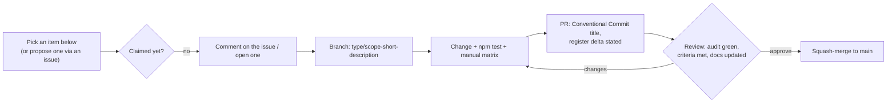

# Roadmap

> What is being fixed, what is being added, and what is deliberately refused — with the register IDs,
> acceptance criteria and effort estimates needed to pick something up.

**Tracing rule:** every item below is either a register entry ([`ARCHITECTURE.md` § 17](ARCHITECTURE.md#17-defect-register))
or an ADR consequence. Nothing arrives on this roadmap as a preference.

**Releases:** `9.5.0` ultra visualisation (shipped) · `9.6.0` correctness carryover · `10.0.0`
structure and access.

---

## Reading this document

| Column | Meaning |
| --- | --- |
| **ID** | Register entry, or `—` for work with no defect attached |
| **Effort** | XS < 1 h · S < 1 day · M < 1 week · L > 1 week |
| **Impact** | What changes for a user if this lands |
| **Acceptance** | The objective condition that closes the item |

Horizons are named after [Semantic Versioning](https://semver.org): patches are corrections, minors
are additive fidelity, majors are structural or contract-breaking.

---

## Shipped — `9.5.0` · Ultra visualization mode

Released **2026-10-03**. Theme delivered: *a second renderer over the same graph — and the honesty
items that had to land first.* Documented in [`ULTRA-VISUALIZATION.md`](ULTRA-VISUALIZATION.md) and
recorded as [ADR-011](DECISIONS.md#adr-011--a-second-renderer-for-ultra-mode--same-graph-additive-canvas-2d).

| ID | Item | Outcome |
| --- | --- | --- |
| — | **Ultra visualization mode** — STANDARD/ULTRA switch, five fields, cognitive weather, dream state, in-window deck | Shipped over the same `graphNodes` / `graphEdges`; `pickNodeAt()` is shared by both renderers |
| `NOO-010` | Counter parity | **Retired** — badge and banner derive from `graphNodes.length` |
| `NOO-011` | Missing domain filter | **Retired** — `ALCHEMY` added to the toolbar |
| `NOO-014` | HiDPI canvas | **Retired** — both canvases scale by DPR, capped at 2× |
| `NOO-021` | Unseeded RNG | **Retired** — `mulberry32`; boot graph reproducible at 90/265, lattice at 128/312 |
| `NOO-016` | Accessibility semantics | **Cleared from the automated count** (17 `aria-*`); the P1 items below remain |
| `NOO-007` | Unescaped sinks | Reduced 4 → 2 sites |
| — | Seeded smoke harness | 36 behavioural assertions in CI beside the audit ([`TESTING.md` § 7.2](TESTING.md#72-the-smoke-harness--npm-run-smoke)) |
| — | Payload budget | Re-baselined to warn **188,000 B** / fail **224,000 B**, anchored to the measured payload |
| — | `prefers-reduced-motion` | Honoured on ultra entry (LOD 1, CONSTELLATION, no dream) — not yet interface-wide |

**Carried out of the release:** every `9.4.2` correctness item that did not fit (the section below),
plus `?seed=` (the generator shipped, the URL parameter did not), the Playwright harness, and the
README screenshot.

---

## Now — `9.6.0` · Correctness carryover

Theme: **the artefact should not contradict itself.** Every item here is small, verifiable, and
either removes a visible flaw or makes an advertised number true.

| ID | Item | Effort | Impact | Acceptance |
| --- | --- | --- | --- | --- |
| `NOO-019` | **Viewport-aware default layout** — clamp and flow the seven windows on boot and resize; keep the desktop metaphor | M | The synthesizer window stops being unreachable on ≤1500 px displays | No window requires a viewport wider than 1280 px to be grabbable; the audit's `NOO-019` count reaches 0 |
| `NOO-001` | **Fix the undefined colour family** — rename `crimson-*` utilities to `neon-crimson-*`, or promote `crimson` to a top-level family | XS | Restores six missing borders; the analytics window stops blending into its background | `NOO-001` reaches 0; the affected panels show their intended borders in all three browsers |
| `NOO-006` | **Replace the invalid Lucide icon** (`dread` → a real name such as `brain-circuit`) | XS | The combinator window regains its header glyph | `NOO-006` reaches 0; the icon renders |
| `NOO-007` | **Escape the remaining human-origin interpolation** — two `innerHTML` sinks | S | Closes the last of the trust-boundary problem | `NOO-007` reaches 0; a filename containing `` renders as literal text |
| `NOO-009` | **Make advertised content true** — correct "240+ fragments" / the `.PDF` claim, or ship the corpus | XS | The interface stops over-claiming | Every claim in the chrome matches its data; `NOO-009` reaches 0 |
| `NOO-012` | **Add the synthesizer to the dock** | XS | The seventh window gains a launcher, compounding the `NOO-019` fix | `NOO-012` reaches 0; the dock lists 7 |
| `NOO-002` `NOO-003` `NOO-004` `NOO-005` | **Tailwind hygiene cluster** — invalid spacing step, undeclared `fadeIn`, undefined `.no-scrollbar`, dead animation config | XS each | Chrome details stop falling back silently | Each count reaches 0 |
| `NOO-013` | **Resolve the static "live" readouts** — drive them from state, or relabel them as static | S | Removes four places where the UI narrates activity that does not exist | `NOO-013` reaches 0 by either route; the choice is documented |
| `NOO-018` | **Link-preview metadata** — description, favicon, Open Graph/Twitter set, theme colour | XS | Shared links render as a card instead of a bare URL — the highest-value item for a portfolio artefact | Validators pass; the card renders in Slack/X/iMessage previews |
| `NOO-008` | **Vendor and pin the three CDN dependencies** — build Tailwind once at release, subset and self-host the fonts, ship a pinned Lucide sprite | M | Offline parity; no vendor drift; enables the hardened CSP | Zero third-party origins; the app renders identically with the network disabled |
| `NOO-020` | **Fixed-timestep STANDARD integrator** — 60 Hz accumulator with interpolated rendering (the ultra field already integrates by `dt`) | S | Identical atlas dynamics on 60/120/144 Hz | The sampler shows the same p95 on a 144 Hz panel; node motion matches at 60 Hz |
| — | **`aria-live` regions** (P1 accessibility) | S | Announces ingestion, injection and composition to screen readers | Transcript, ingestion status and node counter announce without stealing focus |
| — | **Window semantics and headings** (P1 accessibility) | S | Gives assistive technology a navigable structure for seven windows | Each window is a labelled region with a heading |
| — | **Modal focus management** (P1 accessibility) | S | Keyboard users can enter, use and leave the injection modal | Initial focus set, `Escape` closes, focus returns to the trigger |
| — | **Headless harness** — Playwright, pinned, dev-only, driven by the seeded graph | M | Behavioural and visual regression at three reference widths | CI runs the harness; the 1280 px case fails on the pre-`NOO-019` commit and passes after |
| — | **README screenshot + live demo link** | XS | Replaces the placeholder block once the layout is stable | Committed capture at 1440 px from a reproducible run |

**Patch exit criteria:** the audit reports **≤ 8 findings** (from 30), the payload stays inside the
188,000 B warn line, and no new register ID is introduced. Accessibility P1 items ship in this
release as well.

---

## Later — `10.0.0` · Structure and access

Theme: **change the shape of the artefact without changing the promise that it is one openable
file.** Major version because these items move the contract, not just the implementation.

| ID | Item | Effort | Impact | Acceptance |
| --- | --- | --- | --- | --- |
| `NOO-015` | **Standard-atlas spatial index + worker physics** — the ultra field already ships a uniform grid; bring the standard broad phase onto it, optionally moving physics off the main thread with transferable typed arrays | L | Supports a much larger graph (300+ nodes) at 60 fps in either renderer | Pair work for STANDARD drops from `O(n²)` to `O(n·k)`; the graph scales to 300 nodes within budget |
| `NOO-016` | **Keyboard and assistive-technology model** — canvas text alternative, keyboard pan/zoom, node traversal, keyboard window movement (already cleared from the automated count by the 9.5.0 `aria-*` work) | L | Makes the centrepiece usable without a pointing device | The full manual matrix in [`ACCESSIBILITY.md` § 9](ACCESSIBILITY.md#9-verification-plan) passes with a keyboard only |
| — | **Module extraction behind an optional bundler** — one module per PR, `index.html` untouched until the shell swap | L | Reviewability of a growing codebase; keeps the single-file artefact shippable | Source modules exist, a build produces a byte-equivalent artefact, and the audit runs in both modes |
| — | **Templated window chrome** | M | Removes the largest duplication (42 KB of markup > 41 KB of logic) | One template renders all seven windows; markup volume drops materially |
| — | **`TUNING` constants block** | XS | Behaviour adjustable without reading the physics | All 12 tunables in one frozen object, referenced by name |
| `NOO-017` | **Delegated drag listeners** | S | Removes 14 permanent `document` listeners | One delegated listener pair regardless of window count |
| — | **Shareable state** (`#state=` fragment) | M | Reproducible layouts without a backend, consistent with [ADR-006](DECISIONS.md#adr-006--no-persistence-no-backend) | A copied URL restores graph, palette and transcript state with no server involved |
| — | **Fourth domain-composition pass** — grow the vocabulary table so the composer's variation space scales with the corpus | S | Keeps the satire generative rather than repetitive | Composition space documented in `ARCHITECTURE.md` § 12 and updated in the same PR |

**Major exit criteria:** the canvas has a real text alternative; the app is operable by keyboard;
the payload budget is either met or the single-file decision is formally revisited in a superseding
ADR.

---

## Explicitly not planned

Refusals are roadmap decisions too. Each of these would contradict a recorded ADR.

| Not planned | Why |
| --- | --- |
| A backend, accounts or cloud sync | [ADR-006](DECISIONS.md#adr-006--no-persistence-no-backend): the artefact must run offline, forever, with nobody paying for it |
| A real LLM integration | [ADR-005](DECISIONS.md#adr-005--deterministic-procedural-content): determinism, zero cost and offline operation *are* the piece |
| A framework migration | [ADR-003](DECISIONS.md#adr-003--vanilla-javascript-no-framework): there is no synchronisation problem to solve |
| Analytics or telemetry of any kind | Contradicts the privacy posture; the deployable artefact makes no network calls |
| A mobile layout | The desktop metaphor is the design; **reachability** on small screens is fixed (`NOO-019`), a responsive re-layout is not attempted |
| A light theme | [One theme, executed completely](DESIGN.md#10-anti-patterns) |
| Localisation | The satire is language-specific; a translation would be a separate artistic decision, not a roadmap item |
| Rendering the app as a component library for reuse | Speculative until a second consumer exists; § 7 of [`MAINTAINABILITY.md`](MAINTAINABILITY.md#7-extraction-plan) is the prerequisite |

---

## Contribution flow

**Good first issues:** every `XS` item in `9.6.0` except `NOO-019` — each is a single, verifiable
correction with an objective acceptance criterion and a corresponding audit check that will flip to
zero. That is deliberate: the register doubles as an onboarding queue.

**Claiming an item:** open or comment on an issue named `<ID> — <title>`, and say which horizon you
are working in. Two people on one register ID is wasted effort; the ID itself prevents collisions.

---

## Traceability matrix

Every register ID mapped to its horizon. This is the audit's register, kept in lockstep with
[`ARCHITECTURE.md` § 17](ARCHITECTURE.md#17-defect-register) — if the two disagree, the audit's copy
wins.

| Horizon | Register IDs | Count |
| --- | --- | --- |
| Shipped `9.5.0` | `NOO-010` `NOO-011` `NOO-014` `NOO-021` (retired) and `NOO-016` (cleared from the automated count; the capability stays open below) | 5 |
| Now `9.6.0` | `NOO-001` `NOO-002` `NOO-003` `NOO-004` `NOO-005` `NOO-006` `NOO-007` `NOO-008` `NOO-009` `NOO-012` `NOO-013` `NOO-018` `NOO-019` `NOO-020` | 14 |
| Later `10.0.0` | `NOO-015` `NOO-016` `NOO-017` | 3 |
| **Total** | 21 unique IDs (`NOO-016` appears twice: cleared as an audit count, open as a capability) | **21** |

Progress is measured by the baseline shrinking — not by this document being edited.

---

Next: <a href="../CHANGELOG.md">Changelog →</a>

